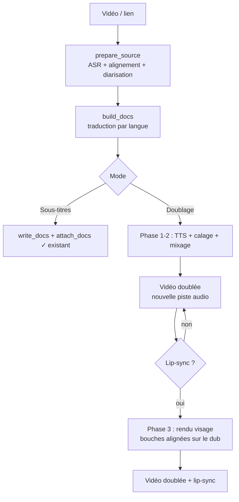

# Helix — Conception : Doublage & Lip-sync

> Document de conception. **Aucune implémentation** ici — il décrit l'architecture
> cible, les modules, les dépendances isolées, les étapes et les risques pour étendre
> Helix de la génération de sous-titres vers le **doublage** puis le **lip-sync**.

---

## 1. Objectif & périmètre

Étendre Helix au-delà des sous-titres :

1. **Doublage** — remplacer la voix d'origine par une voix synthétique dans la langue cible, calée sur le timing, en préservant si possible la musique et les bruitages.
2. **Lip-sync** — ré-générer l'image pour que les bouches à l'écran correspondent à l'audio doublé.

**Principe directeur** : tout repose sur le cœur existant déjà refactoré
(`prepare_source` → `build_docs`), qui fournit transcription, timestamps mot-à-mot,
traduction et diarisation. Le doublage et le lip-sync sont des **étages additionnels**,
jamais des réécritures.

**Ordre non négociable** : `sous-titres ✓` → `doublage` → `lip-sync`.
Le lip-sync consomme l'audio doublé ; il ne peut exister sans le doublage.

---

## 2. Vue d'ensemble



**Réutilisation** : `B` et `C` sont déjà en place. Le doublage part de la sortie de `C`
(segments traduits + timestamps + locuteur). Le lip-sync part de la vidéo source + l'audio
produit par le doublage.

---

## 3. Stratégie de dépendances (critique)

Leçon déjà vécue (`gradio` vs `huggingface-hub < 1.0`) : **ne jamais installer**
les bibliothèques lourdes de TTS / séparation / lip-sync dans le venv principal de
WhisperX. Elles épinglent des versions de `torch`, `numpy`, `opencv` souvent
incompatibles, et certaines ne compilent pas sur RTX 50xx (sm_120 / cu128).

**Règle** : chaque moteur lourd vit dans son **propre venv** et est piloté par
**sous-processus** via une interface fichier simple (entrées/sorties sur disque + JSON).

```
helix/
├── .venv/                 # WhisperX + Flask (existant, intouché)
├── engines/
│   ├── tts/.venv-tts/     # XTTS / Coqui  (ou Edge-TTS, sans venv)
│   ├── sep/.venv-demucs/  # Demucs (séparation voix/fond)
│   └── lipsync/.venv-ls/  # Wav2Lip / MuseTalk / LatentSync
```

Chaque moteur expose un script CLI : `python -m engine_x --in ... --out ... --spec spec.json`.
Helix appelle ces scripts via `subprocess`, lit le résultat, gère les erreurs/annulation.
Avantage : un moteur qui casse n'affecte jamais la stack principale ; on peut en changer
sans rien toucher d'autre.

---

## 4. Phase 1 — Doublage v1 (base indispensable) — ✅ IMPLÉMENTÉ

**But** : prouver le flux de bout en bout avec une qualité « correcte ».

> **État** : livré. `subgen/dub/` (tts.py = Edge-TTS, build.py = calage atempo +
> assemblage numpy + mux), branché dans `pipeline.process` (`dub.enabled`), CLI
> `--dub`/`--voice`, toggle UI « Doublage ». Sortie `nom.<lang>.dub.<container>`
> (voix doublée par défaut + audio original en 2e piste si `keep_original`).
> Limites assumées : voix unique par langue, fond sonore non préservé (Phase 2).

### Modules
- `subgen/dub/tts.py` — interface `TTS.synth(text, lang, voice) -> wav`
  - Backend par défaut : **Edge-TTS** (gratuit, en ligne, bonnes voix arabes MS) ou **Piper** (local).
- `subgen/dub/timing.py` — calage (isochronie) d'un clip TTS dans la fenêtre `[start, end]`.
- `subgen/dub/mix.py` — assemblage de la piste audio doublée + mux ffmpeg.

### Flux
1. Pour chaque segment traduit `(start, end, text)` → TTS → clip wav.
2. **Calage** : ajuster la durée du clip à la fenêtre :
   - si trop long → accélérer (`atempo` / changer le débit TTS), plafonné (~1.3×) pour rester intelligible ;
   - si trop court → silence de fin (padding).
3. Concaténer les clips à leurs timestamps sur une piste muette de la durée de la vidéo.
4. **Mux** : remplacer l'audio (ou ajouter la piste doublée + garder l'original en piste alternative).

### Config (proposée)
```yaml
dub:
  enabled: false
  backend: edge        # edge | piper | xtts
  voice: auto          # voix par langue
  keep_original: true  # garder l'audio d'origine en 2e piste
  max_speedup: 1.3
```

### Sortie
`nom.<lang>.dub.mp4` (audio doublé ; sous-titres optionnels en plus).

### Critère d'acceptation
Vidéo mono-locuteur courte → audio dans la langue cible, globalement synchrone, intelligible.

### Limites assumées de la v1
Voix unique, fond sonore non préservé (ou audio original gardé en doublon), calage simple.

---

## 5. Phase 2 — Doublage v2 (qualité)

### Ajouts
- **Séparation voix/fond** (`subgen/dub/separate.py`, moteur **Demucs** isolé) :
  - extrait `vocals` + `accompaniment` ;
  - on jette `vocals` (la voix d'origine), on **garde** la musique/bruitages.
- **Clonage de voix par locuteur** (moteur **XTTS v2** isolé) :
  - la **diarisation** (déjà produite) découpe des échantillons de référence par locuteur ;
  - chaque locuteur reçoit une voix clonée → la nouvelle réplique imite le timbre d'origine.
- **Calage temporel propre** : étirement par **rubberband** (préserve la hauteur) plutôt que `atempo` brut.
- **Mixage** : `accompaniment` + voix doublées, avec **ducking** (baisser le fond sous la parole).

### Spécificité arabe
Pour les sous-titres on **retire** les harakat ; pour la **TTS arabe** on en a plutôt
besoin (prononciation). → Chemin de texte distinct pour le doublage : **ne pas** stripper
les diacritiques, voire passer par un **diacritiseur** avant la TTS.

### Config (ajouts)
```yaml
dub:
  backend: xtts
  separate_background: true   # Demucs
  clone_per_speaker: true     # via diarisation
  timestretch: rubberband
  duck_db: -12
```

### Critère d'acceptation
Vidéo multi-locuteurs : musique préservée, voix distinctes et naturelles, calage fluide.

---

## 6. Phase 3 — Lip-sync (capstone)

**But** : aligner les bouches à l'écran sur l'audio doublé.

### Modules
- `subgen/lipsync/detect.py` — détection/tracking de visages + **locuteur actif**.
- `subgen/lipsync/render.py` — appel du moteur lip-sync (sous-processus, venv isolé).
- `subgen/lipsync/compose.py` — recomposition des frames + ré-encodage NVENC.

### Moteurs candidats

| Modèle | Qualité | Vitesse | Notes |
|---|---|---|---|
| Wav2Lip | moyenne | rapide | baseline robuste, démarrer ici |
| MuseTalk | bonne | quasi temps réel | bon compromis |
| LatentSync | SOTA (diffusion) | lent | naturel, gourmand en VRAM |
| VideoReTalking | bonne | moyen | préserve les expressions |

### Flux
1. Détecter les visages par frame (tracking inter-frames).
2. **Locuteur actif** : choisir le visage qui parle (active-speaker detection type TalkNet,
   recoupé avec la diarisation audio). Cas multi-personnes = le vrai défi.
3. Conditionner le modèle par l'audio doublé du segment → ré-générer la région bouche.
4. Recomposer dans la frame, ré-encoder (NVENC).
5. **Garde-fous** : pas de visage / hors-champ / coupe rapide → laisser la frame intacte.

### Config (proposée)
```yaml
lipsync:
  enabled: false
  engine: wav2lip       # wav2lip | musetalk | latentsync
  active_speaker: true  # détection du locuteur actif (multi-personnes)
  fallback: passthrough # frames sans visage : inchangées
```

### Critère d'acceptation
Vidéo mono-locuteur face caméra : bouche crédible et synchrone, reste de l'image intact.

### Difficultés majeures
- **Locuteur actif** en scène multi-personnes (le point le plus dur).
- **Qualité/identité** : flou de la zone bouche, raccords, résolution (surtout Wav2Lip).
- **Temps de calcul** : frame-by-frame ; 19 min peut être très long même sur RTX 5090.
- **Dépendances** : repos épinglant de vieilles versions, build incertain sur sm_120 →
  venv isolé + sous-processus obligatoires.

---

## 7. Intégration UI (Helix)

- Nouveau choix de **mode** : `Sous-titres` · `Doublage` · `Doublage + lip-sync`.
- Étapes parlantes additionnelles : « Séparation du fond sonore », « Synthèse des voix »,
  « Calage », « Synchronisation des lèvres ».
- **Avertissement honnête** sur le temps de traitement (surtout lip-sync).
- File d'attente GPU déjà en place (`GPU_LOCK`) — réutilisée pour sérialiser ces étapes lourdes.
- Annulation coopérative déjà en place — ajouter des points de contrôle entre sous-étapes.

---

## 8. Performance (RTX 5090, 32 Go)

- TTS : léger.
- Demucs : modéré (quelques × temps réel).
- Lip-sync : **dominant**. Wav2Lip raisonnable ; diffusion (LatentSync) potentiellement
  plusieurs minutes par minute de vidéo. Prévoir traitement par lot / nuit.

---

## 9. Risques & éthique

- **Deepfake** : le lip-sync modifie le visage d'une personne réelle. À réserver au contenu
  possédé ou explicitement autorisé. Envisager un filigrane « contenu synthétique » et une
  mention claire dans l'UI.
- **Dérive de synchro** sur longues répliques ; naturel de la voix ; fenêtres trop courtes
  pour les langues qui « gonflent » (arabe, français vs anglais).
- **Fragilité des dépendances** : strictement isolées (voir §3).

---

## 10. Plan d'exécution recommandé

1. **Phase 1** — Doublage v1 (Edge-TTS + calage + mux). Valider le flux complet.
2. **Phase 2** — Demucs + clonage XTTS par locuteur + rubberband + ducking.
3. **Phase 3** — Lip-sync Wav2Lip sur mono-locuteur face caméra, puis détection du
   locuteur actif (multi-personnes), puis montée en gamme (MuseTalk / LatentSync).

Chaque phase est livrable et testable indépendamment, et n'altère pas le mode sous-titres existant.

---

## 11. Questions ouvertes

- TTS par défaut : Edge-TTS (en ligne, simple) vs Piper/XTTS (local, plus lourd) ?
- Politique de raccourcissement des traductions trop longues (réécriture LLM « pour tenir » ?).
- Diacritisation arabe pour la TTS : quel outil ?
- Seuil de qualité minimal acceptable du lip-sync avant exposition dans l'UI.
