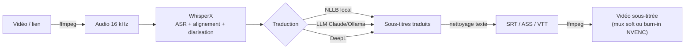

<div align="center">

# 🧬 Helix — Subtitle Generator

**Génère des sous-titres traduits et les attache à n'importe quelle vidéo, en local sur ton GPU.**

[](LICENSE)


-FFC857.svg)


*parole ↻ traduction — deux brins, une traduction.*

</div>

---

Helix écoute une vidéo, **transcrit** chaque mot (WhisperX), **traduit** dans la langue
de ton choix, puis **rattache** les sous-titres à l'image (piste activable ou gravée) —
le tout hors-ligne, sur ta carte graphique. Interface en ligne de commande **et**
interface web.

## Pipeline



## Fonctionnalités

- 🎙️ **Transcription** précise avec alignement mot-à-mot (WhisperX / faster-whisper)
- 🌍 **Traduction configurable** : NLLB (local, ~30 langues), LLM (Claude / Ollama), DeepL
- 🗂️ **Multi-langues en une passe** : plusieurs langues cibles, transcription mutualisée, mux multi-pistes
- 🪢 **Sous-titres bilingues** : source + traduction empilées (apprentissage)
- ✎ **Éditeur intégré** : réviser/corriger les sous-titres avant l'attache
- 🧹 **Nettoyage texte** anti-carreaux (tatweel, harakat, caractères invisibles)
- 🎬 **Attache** : piste activable (mux) ou sous-titres gravés (NVENC, H.264/HEVC)
- 🔗 **Import par lien** : YouTube, Vimeo… (yt-dlp), **playlists**, choix de qualité
- 📦 **Traitement par lot** : plusieurs fichiers ou une playlist en file d'attente
- 🔊 **Doublage (v1)** : voix synthétique dans la langue cible (Edge-TTS), calée sur le timing.
  Sortie en **un seul fichier** `*.dubbed.mp4` avec **pistes audio sélectionnables**
  (original + langue doublée, doublage par défaut) + sous-titres.
  **Fond sonore préservé** (musique/bruitages via Demucs) et étirement *rubberband*
  qui garde la hauteur de voix.
- 🗣️ **Clonage de voix (XTTS)** : doublage qui imite la voix d'origine, par locuteur
  (via la diarisation) — environnement isolé, voir [DESIGN.md](DESIGN.md)
- 🖥️ **Interface web** thème *Helix* : progression, nom de la vidéo, annulation
- ⚡ **Local & GPU** : aucune donnée envoyée en ligne (sauf backends DeepL/Claude au choix)

## Installation

L'environnement `.venv` contient déjà WhisperX + torch (cu128). Sinon :

```powershell
python -m venv .venv
.\.venv\Scripts\python.exe -m pip install -r requirements.txt
# torch CUDA (RTX 50xx) :
.\.venv\Scripts\python.exe -m pip install torch==2.8.0 torchaudio==2.8.0 --index-url https://download.pytorch.org/whl/cu128
```

`ffmpeg` doit être sur le PATH (`ffmpeg -version`).

## Interface web (Helix)

```powershell
.\web.ps1   # démarre le serveur et ouvre http://localhost:7860
```

Glisse une vidéo **ou** colle un lien, choisis les langues et options, suis la
progression (étapes parlantes + barre), annule au besoin, puis télécharge le résultat.

## Ligne de commande

```powershell
.\run.ps1 "C:\videos\conf.mp4" -t ar              # NLLB local, soft-subs, arabe
.\run.ps1 "conf.mp4" -t fr -b llm                 # traduction LLM
.\run.ps1 "conf.mp4" -t es --mode hard --formats srt,ass   # gravé NVENC
.\run.ps1 "conf.mp4" -s ja -t ar                  # forcer la langue source
.\run.ps1 "conf.mp4" -t ar --dub                  # doublage : voix arabe synthétique
.\run.ps1 "conf.mp4" -t ar --clone                # doublage avec clonage de voix (XTTS)
.\run.ps1 "conf.mp4" -t fr,ar --bilingual         # multi-langues + bilingue
```

> Le clonage `--clone` nécessite l'environnement isolé : `.\engines\xtts\setup.ps1`
> (une fois ; télécharge torch + coqui-tts, puis le modèle XTTS ~1.8 Go au 1er usage).

| Option | Effet |
|---|---|
| `-s, --source` | langue d'origine (défaut : détection auto) |
| `-t, --target` | langue cible (ISO 639-1) |
| `-b, --backend` | `nllb` \| `llm` \| `api` |
| `-m, --model` | modèle ASR (`large-v3`, `large-v3-turbo`…) |
| `--mode` | `soft` (mux) \| `hard` (burn-in) \| `none` |
| `--formats` | `srt,ass,vtt` |
| `--diarize` | identification des locuteurs (token HF requis) |
| `--no-translate` | sous-titres dans la langue d'origine |

Tout est aussi réglable dans [`config.yaml`](config.yaml).

## Notes / robustesse

- **Python** : préférer python.org/conda au Python du Microsoft Store (chemins venv/CUDA plus fiables).
- **Windows + Hugging Face** : Helix force `HF_HUB_DISABLE_SYMLINKS=1` (sinon `WinError 1314` sans droits admin).
- **Dépendances** : ne pas installer `gradio` (exige `huggingface-hub ≥ 1.2`, incompatible WhisperX/transformers `< 1.0`) — l'UI utilise Flask.
- **VRAM** : RTX 5090 → `batch_size 24` et `large-v3` en `float16` sans souci.
- `uploads/` et `output/` ne sont pas versionnés (vidéos privées).

## Structure

```
subgen/
├── pipeline.py      orchestration (+ annulation coopérative)
├── transcribe.py    WhisperX (ASR + alignement + diarisation)
├── translate/       moteurs : nllb · llm · api (DeepL)
├── subtitles.py     écriture SRT/ASS/VTT + mise en forme lisible
├── textnorm.py      nettoyage texte (anti-carreaux)
├── attach.py        ffmpeg : mux soft / burn-in NVENC
├── webapp.py        interface web Flask (thème Helix)
├── cli.py           ligne de commande
└── utils.py         ffmpeg, audio, téléchargement par lien
```

## Licence

[MIT](LICENSE) © 2026 EL IDRISSI FAOUZI Rachid
